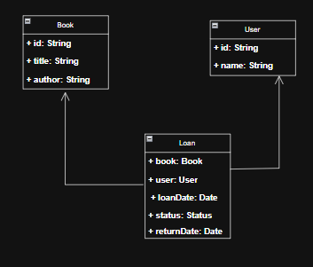
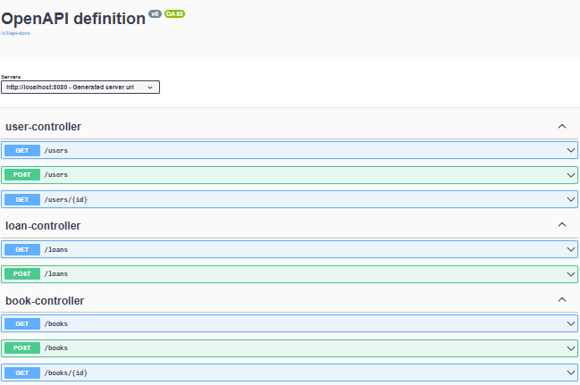

# DOSW-Library

---

## Descripción

Este sistema permite a los usuarios tomar prestados libros de la biblioteca.  
El sistema gestiona los préstamos, verifica la disponibilidad de los libros, y mantiene un registro de los libros prestados.

- Los usuarios pueden agregar libros, obtener todos los libros, obtener un libro por su código de identificación y actualizar su disponibilidad.
- Se pueden registrar usuarios, obtener todos los usuarios registrados y obtener un usuario usando su identificación.

---

### Diagrama de componentes de la biblioteca

---
### Diagrama de componentes especifico de la biblioteca

---
### Diagrama de clases

---
## Pruebas

---
## Evidencias de ejecución

### 1. **Ejecución de la API**
- La API se levantó correctamente usando Spring Boot.
- Endpoints disponibles:

---

### 2. **Cobertura y análisis estático**

- El análisis de cobertura se realizó con JaCoCo.
- El resultado actual de la cobertura:

- SonarQube:

---

### 3. **Ejecución de pruebas unitarias**
- Las pruebas se ejecutaron mediante Maven:
