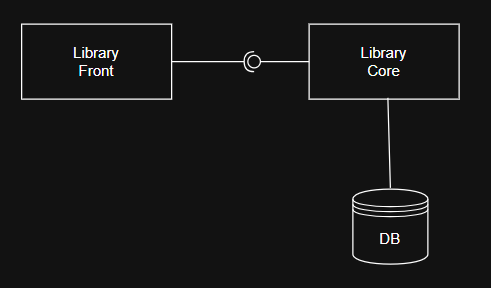
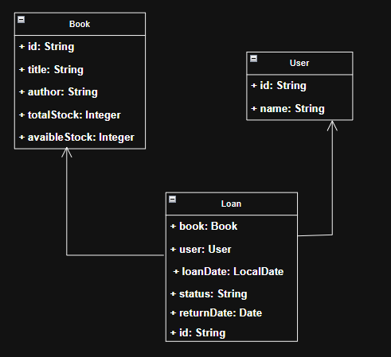
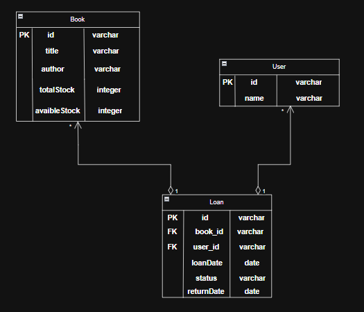
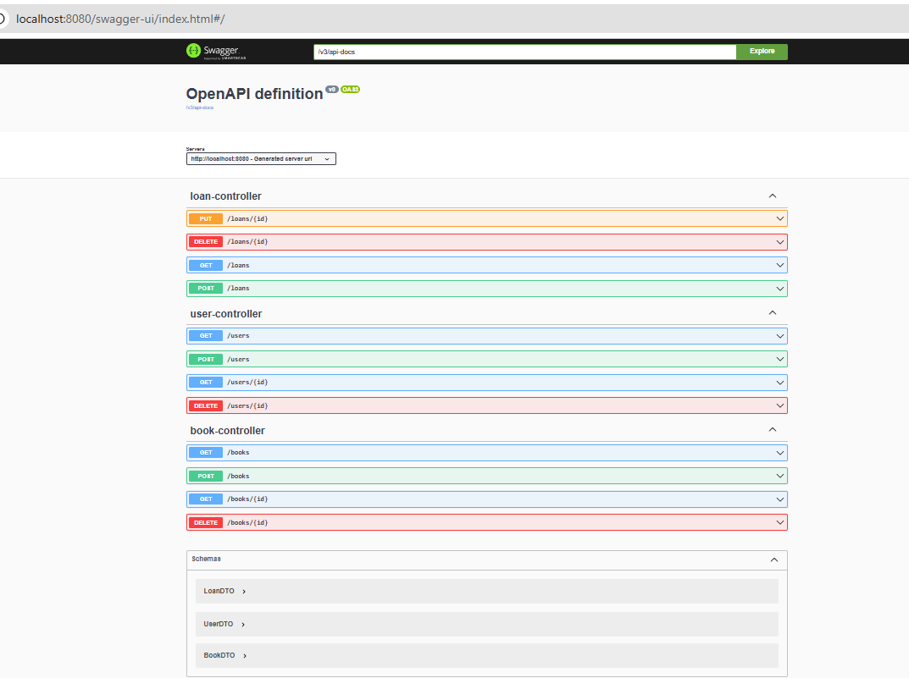
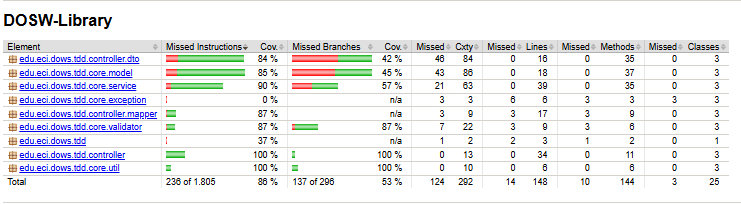
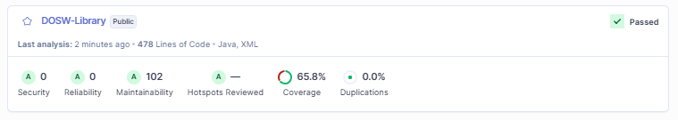
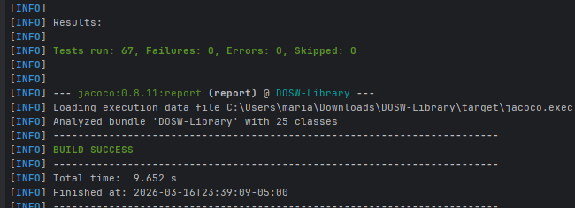
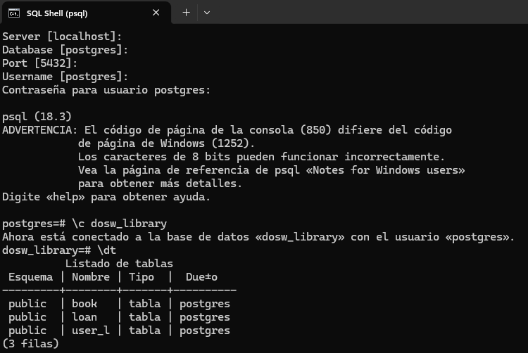

# DOSW-Library

---

## Descripción

Este sistema permite a los usuarios tomar prestados libros de la biblioteca.  
El sistema gestiona los préstamos, verifica la disponibilidad de los libros, y mantiene un registro de los libros prestados.

- Los usuarios pueden agregar libros, obtener todos los libros, obtener un libro por su código de identificación y actualizar su disponibilidad.
- Se pueden registrar usuarios, obtener todos los usuarios registrados y obtener un usuario usando su identificación.

---

### Diagrama de componentes de la biblioteca

Este diagrama representa la arquitectura general del sistema de biblioteca.
Library Front simboliza la capa de presentación, es decir, la interfaz a través de la cual los usuarios interactúan enviando solicitudes (como registros o préstamos). Esta capa se comunica con Library Core, que contiene toda la lógica del negocio como gestión de usuarios, libros y préstamos. Finalmente, Library Core interactúa directamente con la base de datos (DB) para almacenar y recuperar la información necesaria. De este modo, se logra una separación clara entre la presentación, la lógica del dominio y el almacenamiento de datos.

---
### Diagrama de componentes especifico de la biblioteca

En este diagrama se detalla cómo se conectan los componentes internos para cada flujo.
Los controladores (UserController, BookController, LoanController) reciben las solicitudes desde el exterior y manejan los DTOs. Los controladores redirigen las operaciones a los servicios (UserService, BookService, LoanService), los cuales contienen las reglas y validaciones de negocio.
Antes de procesar la solicitud, los validadores (UserValidator, BookValidator, LoanValidator) aseguran que los datos cumplen con las reglas necesarias.
Los mapeadores (UserMapper, BookMapper, LoanMapper) facilitan la conversión entre entidades de dominio y DTOs, asegurando que solo la información específica y necesaria se exponga o se procese.
Este diseño modular promueve la mantenibilidad y la correcta separación de responsabilidades.

---
### Diagrama de clases

Este diagrama muestra las principales entidades del sistema:

Book: Representa los libros disponibles en la biblioteca, con atributos como id, title y author.
User: Modela los usuarios registrados, identificados principalmente por su id y name.
Loan: Representa cada préstamo de un libro a un usuario, asociando a ambos mediante los campos book y user. Además, mantiene información sobre las fechas de préstamo y devolución, estado del préstamo (status) e identificador único (id).
Las flechas indican las relaciones entre clases: un Loan siempre está vinculado a un Book y a un User, reflejando así cómo se modelan y relacionan los datos en la aplicación.

### Modelo entidad-relación

El modelo se encuentra en tercera forma normal ya que todas las tablas poseen clave primaria, no hay datos redundantes, y no existen dependencias transitivas. Las relaciones son de agregación, permitiendo la independencia de Book y User si se elimina un Loan.

---
## Pruebas

---
## Evidencias de ejecución

### 1. **Ejecución de la API**
- La API se levantó correctamente usando Spring Boot.
- Endpoints disponibles:

Link del video de la ejecución:
https://youtu.be/e89HZGdI1U0
---

### 2. **Cobertura y análisis estático**

- El análisis de cobertura se realizó con JaCoCo.
- El resultado actual de la cobertura:

  El reporte de cobertura de pruebas fue generado usando la herramienta JaCoCo.
  La tabla muestra el porcentaje de instrucciones y ramas cubiertas por las pruebas unitarias y funcionales en las principales clases del sistema. Este análisis evidencia que los tests ejecutan más del 86% de las líneas de código, demostrando un nivel adecuado de cobertura y verificando el correcto funcionamiento de la lógica central de la biblioteca.
- SonarQube:

  SonarQube se utilizó para realizar un análisis estático del código, evaluando aspectos de seguridad, mantenibilidad y calidad general.
  Como se observa en el informe, no se detectaron vulnerabilidades ni puntos críticos (“bugs” o “code smells”). 
- El porcentaje de cobertura que reporta SonarQube es ligeramente menor al mostrado por JaCoCo porque SonarQube incluye en su análisis otros archivos o clases auxiliares, y evalúa el total de líneas de manera más estricta, considerando también partes del código menos críticas para la lógica principal. Sin embargo, la cobertura de JaCoCo sobre el código principal del proyecto (86%) es la referencia estándar y es la que garantiza que se cumple el nivel de pruebas esperado según los criterios de la rúbrica.
---

### 3. **Ejecución de pruebas unitarias y funcionales**
- Las pruebas se ejecutaron mediante Maven:

El proyecto cuenta tanto con pruebas unitarias (sobre modelos, mappers, servicios, validadores y utilidades), como con pruebas funcionales usando MockMvc, abarcando los flujos principales de la API (users, books, loans) y asegurando el correcto funcionamiento end-to-end de los endpoints y la integración de los componentes.

---

### 4. Validaciones y manejo de errores

- Se implementaron validaciones tanto a nivel de entrada de datos (anotaciones y validadores) como a nivel de lógica de negocio.
- Se validan entradas nulas o inválidas y reglas de negocio (por ejemplo, no permitir préstamos duplicados ni exceder el límite).
- Los errores relevantes devuelven respuestas JSON claras y estructuradas, gestionadas mediante un manejador global de excepciones.

---
### 5. Clases utilitarias

Se implementaron utilidades como los mapeadores entre entidades y DTOs (LoanMapper, UserMapper, BookMapper), validadores (LoanValidator, BookValidator, UserValidator), y utilidades generales para fechas e identificación, que facilitan la reutilización y mantienen la lógica separada y ordenada.

### Persistencia:
Prueba conexión base de datos:

Para eliminar la utilización de estructuras de datos como persistencia en memoria:
Se elimina cualquier List, Map u otra colección de persistencia en memoria.
Se inyecta el repositorio correspondiente en cada servicio mediante constructor.
